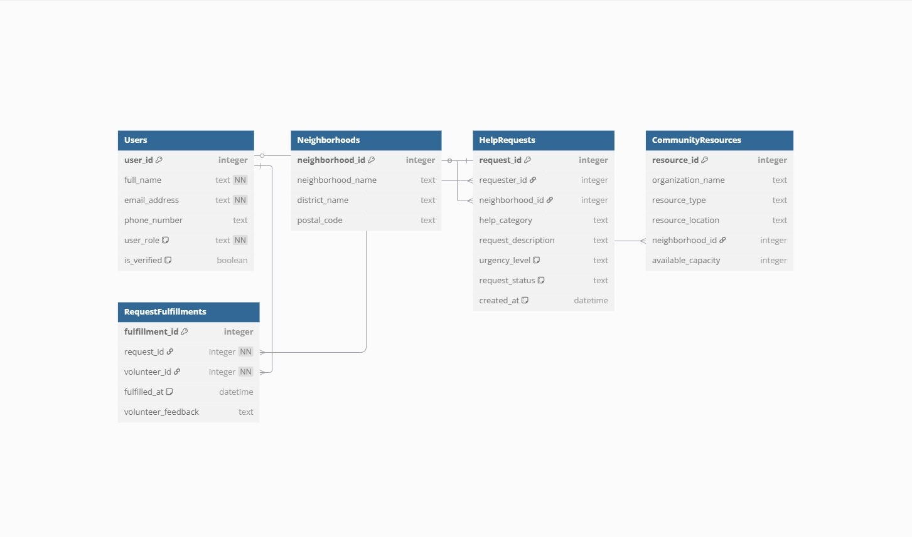

# Design Document

City`s Social Support App Project By Dobre Alin Cristian

Video overview: <https://youtu.be/WfZ9AsfWJ60>

## Scope

In this section you should answer the following questions:

* What is the purpose of your database?

The purpose of the City`s Social Support App Project database is to facilitate fast, localized, and reliable connections between individuals in need of help (e.g., food, shelter, emotional support) and available micro-local resources or verified volunteers who can assist. It is designed to reduce response time, empower community-level action, and avoid dependency on slow bureaucratic systems.

* Which people, places, things, etc. are you including in the scope of your database?

People:

Individuals requesting aid

Verified volunteers

Local aid organizations (e.g., shelters, tutoring centers)

Places:

Neighborhoods or districts in the city

Physical aid locations (e.g., food banks, shelters)

Things:

Types of aid (tags such as food, shelter, tutoring, mental health)

Requests and offers of help

Fulfillment logs to track resolved needs

* Which people, places, things, etc. are *outside* the scope of your database?

Non-local or national-level aid organizations

Monetary transactions or donation tracking

Government welfare program records

Law enforcement or legal entities

## Functional Requirements

In this section you should answer the following questions:

* What should a user be able to do with your database?

Register as a volunteer with verified identity and aid capabilities

Submit a request for help, specifying urgency and type

Search for available resources by neighborhood and category

View the status of requests (pending, fulfilled, expired)

Log fulfillment of a request and optionally leave feedback

Generate summaries (e.g., most common needs in a neighborhood)

* What's beyond the scope of what a user should be able to do with your database?

Financial transactions or donations

Direct communication within the database (handled externally)

Managing medical or legal records

Complex fraud detection or background checks beyond basic verification

## Representation

Entities are captured in SQLite tables with the following schema.

### Entities

In this section you should answer the following questions:

* Which entities will you choose to represent in your database?

In the City`s Social Support App Project database, I chose to represent the following entities: User, Neighborhood, Request, Resource, and Fulfillment. Each of these plays a specific role in the system. The User entity represents individuals involved in the system, either as requesters of aid or as volunteers providing help. Neighborhood is used to geographically organize requests and resources within the city. Request captures the actual help being sought, while Resource represents fixed aid sources such as shelters or food banks. Finally, Fulfillment records which volunteer responded to which request and when.

* What attributes will those entities have?

The User entity has attributes including id, name, email, phone, role (requester or volunteer), and a verified status (a boolean). The Neighborhood entity includes id, name, district, and postal_code. The Request entity includes id, user_id (foreign key), neighborhood_id (foreign key), type_tag (e.g., food, shelter), description, urgency_level (low, medium, high), status (pending, fulfilled, expired), and timestamp. The Resource entity includes id, organization_name, type_tag, location, neighborhood_id, and capacity. The Fulfillment entity has id, request_id, volunteer_id, fulfilled_at, and optional feedback.

* Why did you choose the types you did?

I chose data types based on the nature and expected usage of each field. Primary keys like id are integers or UUIDs for uniqueness and efficient indexing. Text fields such as name, description, and location are stored as strings or TEXT to accommodate varying lengths. Enums or fixed strings are used for fields like urgency_level and status to enforce consistency across records. Timestamps are used to track creation or fulfillment times for sorting and historical data analysis. Booleans are used for simple true/false values, like the verified status of a user. These choices support the expected queries and operations while keeping data storage efficient.

* Why did you choose the constraints you did?

Constraints were chosen to ensure data accuracy, consistency, and reliability. NOT NULL constraints are applied to essential fields like name, role, and urgency_level, so incomplete records cannot be saved. UNIQUE constraints are used for contact information like email to avoid duplication of users. CHECK constraints are used on fields like urgency_level and status to restrict values to allowed options (e.g., only "low", "medium", or "high"). FOREIGN KEY constraints ensure that references between entities—like a request pointing to a user or a resource tied to a neighborhood—are valid and maintain referential integrity. These constraints protect the logical consistency of the database and reduce the risk of invalid or orphaned data.

### Relationships

The below entity relationship diagram describes the relationships among the entities in the database.

1. Users
Primary Key: user_id

Relationships:

Referenced by HelpRequests.requester_id (a user can make many help requests).

Referenced by RequestFulfillments.volunteer_id (a user acting as a volunteer can fulfill many requests).

Appears in the Active_Help_Requests_With_Volunteers view.

2. Neighborhoods
Primary Key: neighborhood_id

Relationships:

Referenced by HelpRequests.neighborhood_id (a request happens in one neighborhood).

Referenced by CommunityResources.neighborhood_id (resources are located in one neighborhood).

Used in views to summarize or display location-based information.

3. HelpRequests
Primary Key: request_id

Relationships:

References Users.requester_id (who requested help).

References Neighborhoods.neighborhood_id (where help is needed).

Referenced by RequestFulfillments.request_id (a request can be fulfilled by a volunteer).

Appears in both views (Active_Help_Requests_With_Volunteers, Neighborhood_Help_Resource_Summary).

4. CommunityResources
Primary Key: resource_id

Relationships:

References Neighborhoods.neighborhood_id (resource location).

Aggregated in Neighborhood_Help_Resource_Summary view.

5. RequestFulfillments
Primary Key: fulfillment_id

Relationships:

References HelpRequests.request_id (which request was fulfilled).

References Users.volunteer_id (who fulfilled the request).

Used in both views for tracking completion and volunteer activity.

Summary of Relationships:
One-to-many:

One User can make many HelpRequests.

One Neighborhood can have many HelpRequests and CommunityResources.

One HelpRequest can be fulfilled by one RequestFulfillment.

Many-to-one:

Many CommunityResources belong to one Neighborhood.

Many RequestFulfillments refer to a single User as the volunteer.

Many RequestFulfillments refer to a single HelpRequest.

## Optimizations

In this section you should answer the following questions:

* Which optimizations (e.g., indexes, views) did you create? Why?

Several optimizations to improve performance and efficiency:

Indexes on foreign keys such as user_id, neighborhood_id, and request_id improve JOIN performance when retrieving linked data (e.g., all requests in a neighborhood or all fulfillments by a specific volunteer).

Index on type_tag for both the Request and Resource entities enables quick filtering based on the category of help needed or provided. This is especially useful in search queries when users look for specific types of aid like “food” or “mental health.”

Composite index on neighborhood_id and urgency_level in the Request table allows for efficient sorting and filtering when displaying high-priority requests in a particular location.

Full-text search index on description and feedback fields enables keyword-based searching. This is helpful for users and administrators trying to find patterns in request content or feedback logs.

Materialized view of the most active neighborhoods by number of requests or fulfilled cases can be used for dashboards and analytics, giving quick access to high-level summaries without running costly queries repeatedly.

These optimizations ensure the system can scale efficiently as the number of requests and users grows, without sacrificing responsiveness.

## Limitations

In this section you should answer the following questions:

* What are the limitations of your design?

One limitation of the current design is its inability to manage real-time volunteer availability or scheduling. While users can offer help, the system does not allow volunteers to specify the exact days or hours they are available, nor can it prevent overlapping commitments. This makes coordination more difficult for time-sensitive or recurring support needs.

Another limitation is the basic verification system. Volunteers can be flagged as "verified," but the database does not track when, how, or by whom the verification was done. This limits the level of trust and accountability the platform can provide, especially in situations where background checks or references would be necessary.

The design also lacks support for scalable communication features. For example, direct messaging or notification handling between volunteers and requesters is outside the scope of the database and would need to be implemented through external systems or services.

* What might your database not be able to represent very well?

The database may struggle to represent complex, multi-party tasks, such as those requiring several volunteers to work together (e.g., moving furniture for a shelter or organizing a community meal). It assumes a one-to-one connection between a request and a volunteer, which oversimplifies scenarios that require group coordination.

It also does not represent dynamic or conditional needs well. For example, if a person’s need depends on another need being fulfilled first (like housing before employment support), the database cannot naturally express these dependencies.

In addition, the current design does not support multilingual data. Request descriptions and feedback are stored in a single language, which limits accessibility in cities with diverse populations unless additional localization tables or translation fields are added.

Lastly, the system is not built to represent emotional or psychological context in depth. While it can tag requests as “emotional support,” it cannot capture ongoing mental health cases, long-term relationships between supporters and recipients, or nuanced well-being data.
